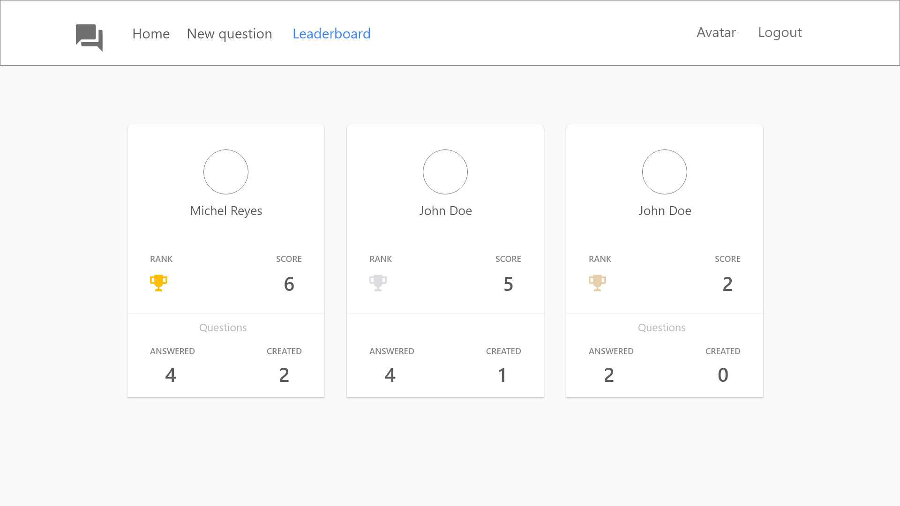

# Planing Stage

## Step 1 - identify Each View
Determine look and functionality of each view in the app.

## View for the Login page

* Is located at (/).
* The user could select a character from the list of existing users.

## View for the Home Page

* Is located at (/home)
* Shows answered and unanswered polls sorted from most recently added at the top, to oldest at the bottom.
* The user can alternate between viewing answered and unanswered polls.
* The user can navigate to **Leaderboard**, can make a **New Question**
* Each question will show:
  * The author
  * The text of the question
  * A link to the details of the poll (**Poll Question**)

## View for the Poll Question

* Is located at (questions/:question_id)
* Shows a individual question
* Each poll question will show 
  * The author
  * The two options

## View for the Poll Result

* Is locatee at (questions/:question_id)
* Shows the answered poll result
* Each poll result will show
  * The text of the option
  * The number of people who voted for that option
  * The percent of people who voted ofr that option
  * The option selected by the loged in user should by clearly marked

## View for the New Poll

* Is located at (/add)
* Has a form for creating a poll with two options question

## View for the Leaderboard

* Is located at (/leaderboard)
* Shows the score of the leading competitors
* Each entry on the leaderboard will show
  * The user name and picture
  * The number of questions the user asked
  * The number of questions the user answered