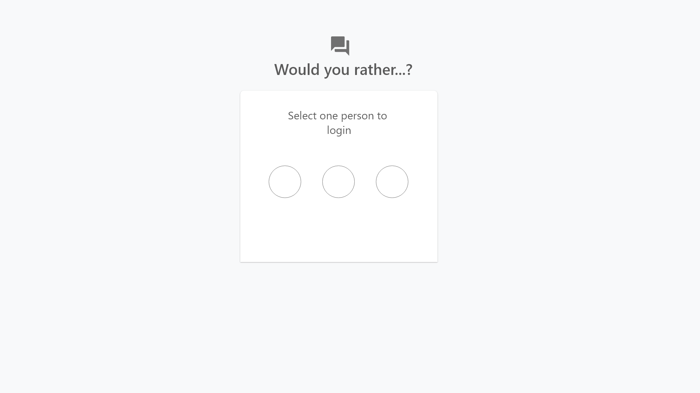
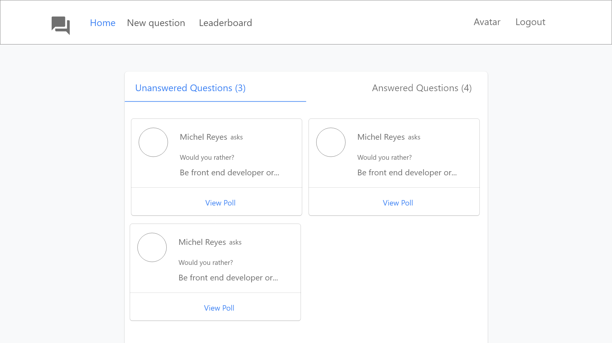

# Planing Stage

## Step 1 - identify Each View
Determine look and functionality of each view in the app.

## View for the Login page

* Is located at the home route (/).
* The user could select a character from the list of existing users.

## View for the Home page

* Is located at (/home)
* Shows answered and unanswered polls sorted from most recently added at the top, to oldest at the bottom.
* The user can alternate between viewing answered and unanswered polls.
* The user can navigate to **leaderboard**, can make a **new question**
* Each question sill show:
  * 