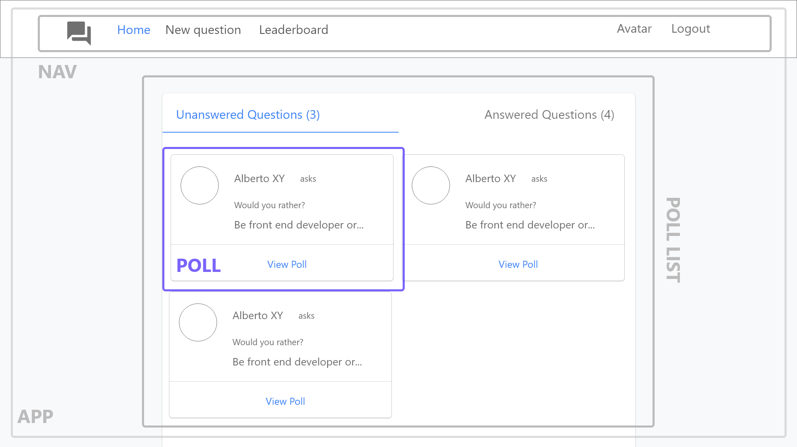

# Planing Stage

## Step 1 - Identify Each View

Determine look and functionality of each view in the app.

## View for the Login page

- Is located at (/).
- The user could select a character from the list of existing users.

## View for the Home Page

- Is located at (/home)
- Shows answered and unanswered polls sorted from most recently added at the top, to oldest at the bottom.
- The user can alternate between viewing answered and unanswered polls.
- The user can navigate to **Leaderboard**, can make a **New Question**
- Each question will show:
  - The author
  - The text of the question
  - A link to the details of the poll (**Poll Question**)

## View for the Poll Question

- Is located at (questions/:question_id)
- Shows a individual question
- Each poll question will show
  - The author
  - The two options

## View for the Poll Result

- Is locatee at (questions/:question_id)
- Shows the answered poll result
- Each poll result will show
  - The text of the option
  - The number of people who voted for that option
  - The percent of people who voted ofr that option
  - The option selected by the loged in user should by clearly marked

## View for the New Poll

- Is located at (/add)
- Has a form for creating a poll with two options question

## View for the Leaderboard

- Is located at (/leaderboard)
- Shows the score of the leading competitors
- Each entry on the leaderboard will show
  - The user name and picture
  - The number of questions the user asked
  - The number of questions the user answered

## View Recap

So these are the 6 views we need in our app:

1. Login
2. Home
3. Poll Question
4. Poll Result
5. New Poll
6. Leaderboard

## Step 2 - Break Each View Into a Hierechay of Components

- Draw boxes around every component
- Arrange components into hierarchy

> Components should be a main part of the app following the single responsibility principle and be reusable.

## Components for the Login View

This view is broken down into the following React Components

- **APP** - the overall container for the project
  - **Login** - display the list of characters accounts

## Components for the Home View

This view is broken down into the following React Components

- **APP** - the overall container for the project
  - **Nav** - display the navigation
  - **Poll List** - display a list of unanswered and answered polls
    - **Poll** - display the content for a single poll

## Components for the Poll Question View

This view is broken down into the following React Components

- **APP** - the overall container for the project
  - **Nav** - display the navigation
  - **Poll Question** - display the poll two questions

## Components for the Poll Result View

This view is broken down into the following React Components

- **APP** - the overall container for the project
  - **Nav** - display the navigation
  - **Poll Result** - display both poll question with # of votes and percentage

## Components for the New Poll View

This view is broken down into the following React Components

- **APP** - the overall container for the project
  - **Nav** - display the navigation
  - **New Poll** - display form for submit new poll

## Components for the Leaderboard View

This view is broken down into the following React Components

- **APP** - the overall container for the project
  - **Nav** - display the navigation
  - **Leaderboard List** - display a list of top three users
    - **Leaderboard Card** - display a single leaderboard stats

## All components

- App
- Login
- Poll Lits
- Poll
- New Poll
- Poll Question
- Poll Result
- Leaderboard List
- Leaderboard Card
- Nav

"This component hierarchy tells us which components will be used inside of other components. It gives us the skeleton of our app.

All of these are presentational components. Right now, we don't care which components will be upgraded to containers. As we start building out the store, we'll create additional components that will be container components to get data from the store and pass it to the presentational components that need the data."

## Step 3 - What Events Happen in the App

"We need to take a look at what is happening in each component. Let's determine what actions the app or the user is performing on the data. Is the data being set, modified, or deleted?...then we'll need an action to keep track of that event!

Let's _italicize_ the action, **bold** the data and actions between brakets".

## App Component

When the app load at the first time it needs to fill the store with data.

- _get_ the **users** (`GET_USERS`)
- _get_ the **questions** (`GET_QUESTIONS`)

## Login Component

For the Login Component we need the list of all users.

- _get_ the **users**
- _set_ the **authedUser** (`SET_AUTH_USER`)

## Poll List Component

For the Poll List Component we need the list of all questions, the authors name and avatar and the authedUser

- _get_ the **questions**
- _get_ the **users**, so the name and avatar of the question's author can display.
- _get_ the **authedUser** (`GET_AUTH_USER`), to know the unanswered and answered questions from the user that is currently logged in.

## Poll Component

- _get_ a particular question from the list of **questions**
- _get_ a particular user from the list of **users**

## New Poll

- _get_ the **authedUser**, so the user can create a _new_ **question** (poll)
- _set_ the two question options **text** (`CREATE_POLL`)

## Poll Question

- _get_ a particular user from the list of **users**
- _get_ a particular question from the list of **questions**
- _set_ **option** for the answered question (`ANSWER_POLL`)

## Poll Result

- _get_ a particular user from the list of **users**
- _get_ a particular question from the list of **questions**
- _get_ the **authedUser**, so we can mark the user selected option

## Leaderboard List

For the Leaderboard List Component we need the list of all the users.

- _get_ the **users**

## Leaderboard Card

- _get_ a particular user from the list of **users**

## Nav

- _get_ the **authedUser**
- _unset_ the **authedUser** (`UNSET_AUTH_USER`), logout.

## Step - 4 Data and the Store

### Data elements and list of dependencies

* Users
* Questions
* AuthedUser
* Text (for new questions)
* Option (for answered questions)

|Components       |Users|Questions|AuthedUser|Text|Option|
|-----------------|-----|---------|----------|----|------|
|App              |  x  |    x    |          |    |      |
|Login            |  x  |         |     x    |    |      |
|Poll Lits        |  x  |    x    |     x    |    |      |
|Poll             |  x  |    x    |          |    |      |
|New Poll         |     |         |     x    | x  |      |
|Poll Question    |  x  |    x    |          |    |  x   |
|Poll Result      |  x  |    x    |     x    |    |      |
|Leaderboard List |  x  |         |          |    |      |
|Leaderboard Card |  x  |         |          |    |      |
|Nav              |     |         |     x    |    |      |

---

### Store

For each piece of data, let's see whether is used by multiple components or mutated in a complex way.

**Text** and **Option** used by New Poll and Poll Question components, do not mutate in a complex way. That means that it's great candidate for component state instead of app state that resides in teh store.

**Users**, **Questions** and **AuthedUser** are used by multiple components and mutate in a complex way or is accessed globally, all this data is perfectly suited for the store.

### Data elements separated by store or by component state

* **store**
  * Users
  * Questions
  * AuthedUser
* **component state**
  * Text
  * Option
