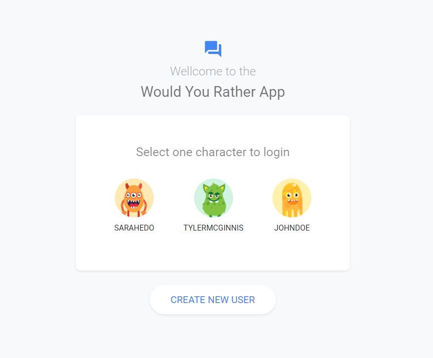
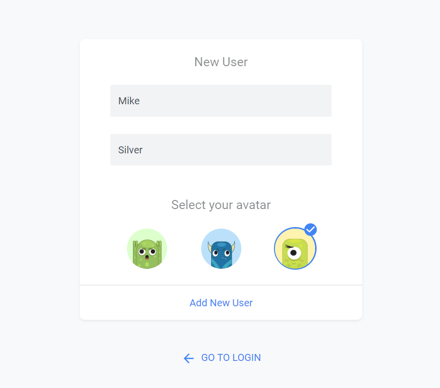
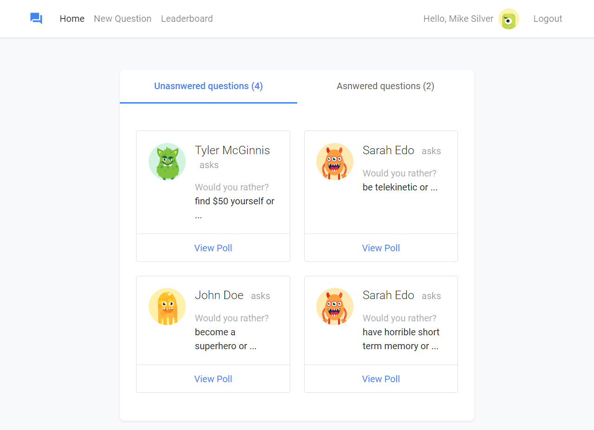
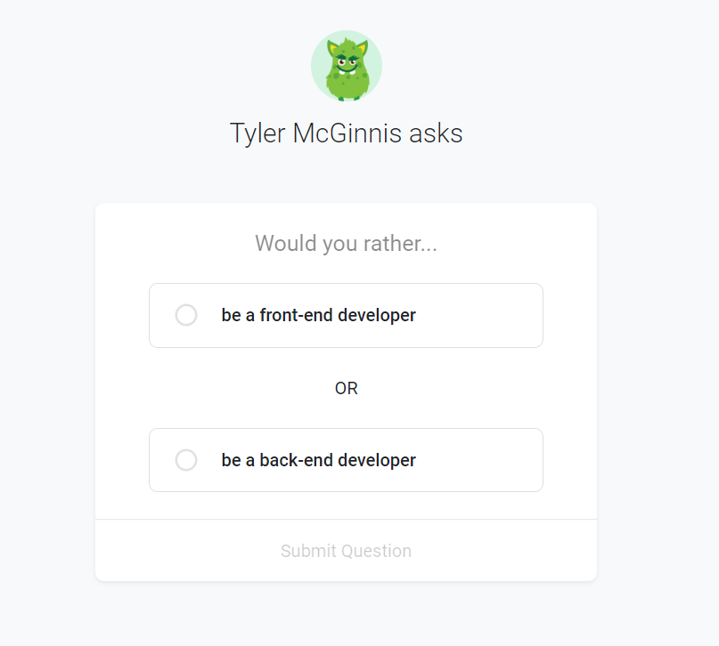
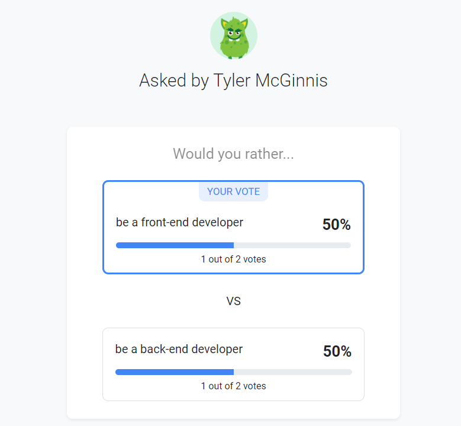
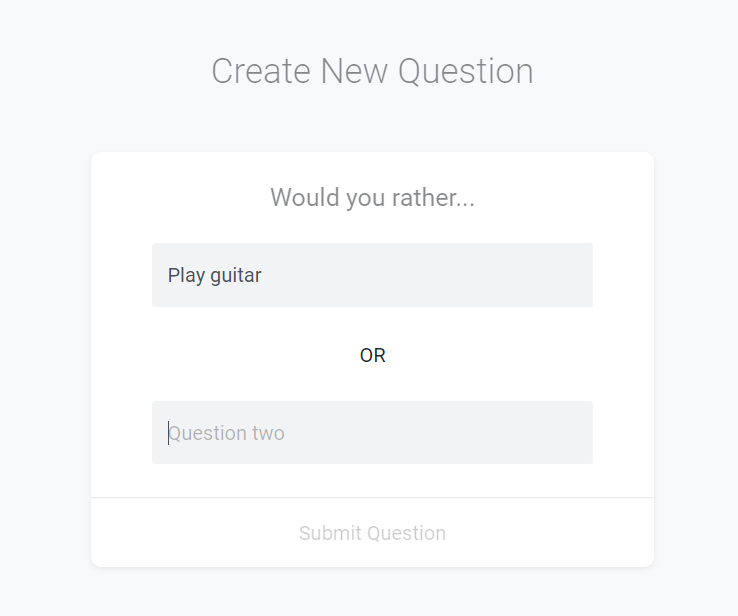
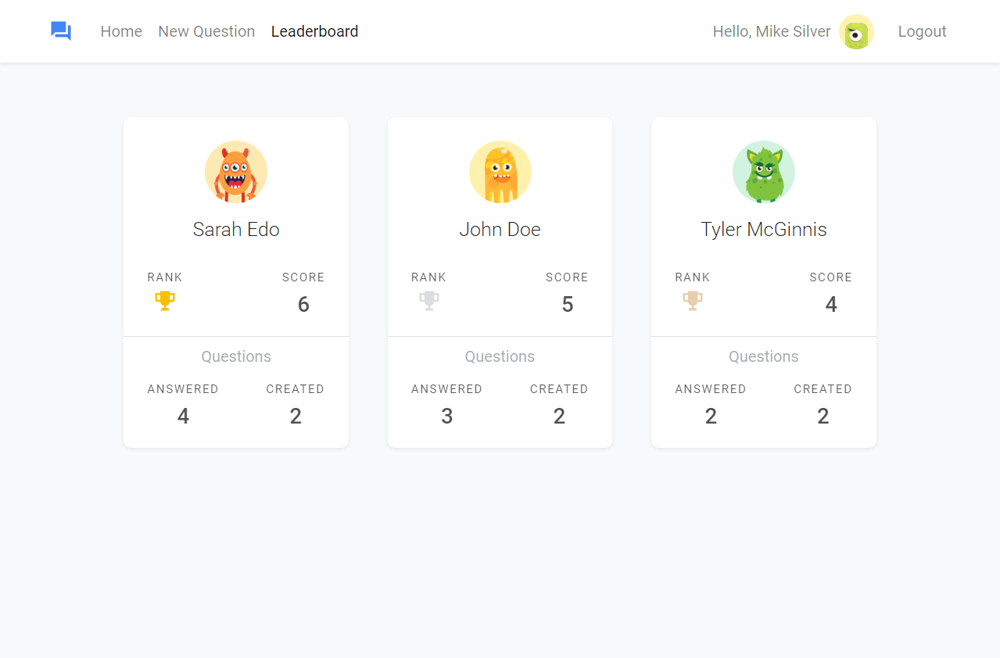

# Would You Rather Project

## Project purpose:
This project was built for the UdacityNanodegree Program. The purpose of the project is to demonstrate understanding of the fundamentals of the Redux & React-Redux ecosystem.

You can run a hosted version of the app at: [Would You rather?](https://would-you-rather-m-reyes.herokuapp.com/)

You can see the planning stage at: [Planning Stage](./PlanningStage.md)

## Loading the App

The project uses Node.js and the Create-React-App starter.
Once Node is installed, navigate to the directory where you want to store the app.

```bash
git clone https://github.com/m-reyes-h/UND-project-Would-You-Rather.git
npm install
npm start
```
A new browser window should automatically open. If it doesn't, navigate to http://localhost:3000/ in your browser.



## Using the App

"Would You Rather?" project, is a web app let you play the "Would You Rather?" game.  The game goes like this: A user is asked a question in the form: “Would you rather [option A] or [option B] ?”. Answering "neither" or "both" is against the rules.

Users will be able to answer questions, see which questions they haven’t answered, see how other people have voted, post questions, and see the ranking of users on the leaderboard.

#### Login page

The app starts on a login page where you can select a user from a precomposed list or create a new one.


NOTE:  The user should be signed in order to access the application pages.

#### New User page

You can enter the desired first name, last name and select an avatar from the list.




#### Home page

Once the user logs in into the app your can see the "Home" page and sould be able to toggle between his/her answered and unanswered polls.

>Alternatively, you can *Create* a **New Question**, *Go* to the **Leaderboard** or **Log out**



#### Unanswered / Answered polls

<center>Unanswered question</center>



<center>Answered question</center>


_You can only search by author or title. So, don't worry if you don't find a specific author or title._


#### New Question page

The new created polling question should appear in the unanswered questions category on the home page.



#### Leaderboard page

The more questions you ask and answer, the higher up you move!




### Resources and Documentation:

- [Create-react-app Documentation](https://github.com/facebookincubator/create-react-app)
- [React Router Documentation](http://knowbody.github.io/react-router-docs/)
- [React API](https://facebook.github.io/react/docs/react-api.html)
- [React Redux docs](https://react-redux.js.org/)
- [Avatar images](https://www.freepik.com/free-vector/)
- [Protected Routes](https://tylermcginnis.com/react-router-protected-routes-authentication/
) , [Render Routes](https://reacttraining.com/react-router/web/api/Route/render-func) and [Redirect](https://reacttraining.com/react-router/web/api/Redirect)

### Udacity Resources:

- [Project starter template](https://github.com/udacity/reactnd-project-would-you-rather-starter)
- [Project Rubric](https://review.udacity.com/#!/rubrics/1567/view)
- [Udacity CSS Style Guide](http://udacity.github.io/frontend-nanodegree-styleguide/css.html)
- [Udacity HTML Style Guide](http://udacity.github.io/frontend-nanodegree-styleguide/index.html)
- [Udacity JavaScript Style Guide](http://udacity.github.io/frontend-nanodegree-styleguide/javascript.html)